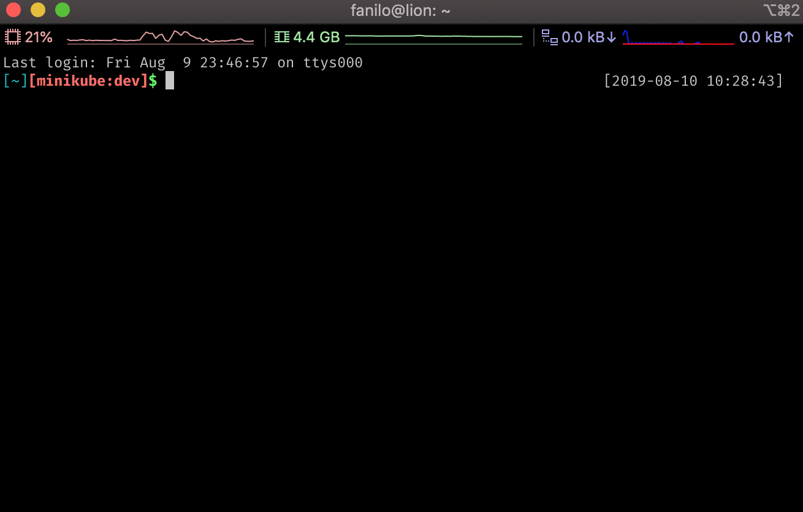

# ZSH Themes
> A collection of custom themes for Oh my ZSH.

## Getting started
```
cd ~/.oh-my-zsh/custom/themes
git clone https://github.com/nylo-andry/zsh-themes.git
```

`~/.zshrc`
```
...
ZSH_THEME="zsh-themes/<name-of-theme>"
...
```

## Themes

### Tsotra (simple in Malagasy)



#### Usage
`~/.zshrc`
```
...
ZSH_THEME="zsh-themes/tsotra"
...
```

